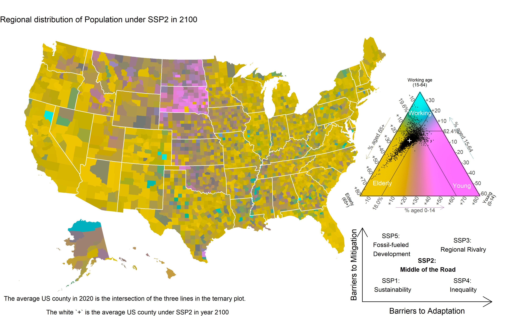

We are intersted in **demographic population projections and their applications**, **human mobility**, **human fertility**, and **human mortality** with an emphasis on how **climate change** will impact these processes. Our work aims to link **climate change** with **demographic processes** to understand how climate change will impact society.

Our research **stands at the interface between sociology, demography, and climate science**, using demographic techniques and sociological theory to describe the impacts of the biggest challenge of our time: climate change.

