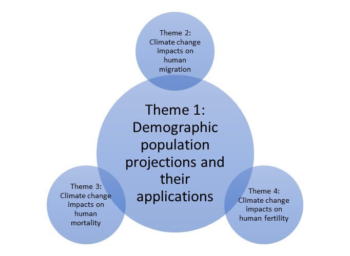

My research focuses on the intersection between climate change and demographic processes to better understand the current and projected impacts of climate change on human society. My long-term research goal is to holistically describe these impacts. Unfortunately, many demographic techniques and methods are underdeveloped to properly quantify climate impacts. My research team routinely develops new techniques and methods and harnesses these developments to quantify climate impacts on human populations.

**1) Demographic Projections and their Applications**

 

Climate change impacts are occurring all of the world however many impacts are still projected to be in the future. Without properly situating future climate change impacts with future populations, we risk significantly misrepresenting these impacts by coupling a dynamic environment (climate change) with a static society (current populations). Recent calls to couple sociodemographic futures with biophysical futures (ie climate change) strongly emphasize this point  ([*Lutz and Muttarak 2017*](https://www.nature.com/articles/nclimate3222)). Societies are sure to change and it is imperative to properly model this change. My primary research aims to develop multi-dimensional predictive models of sociodemographic change to create demographic futures that we will then couple with climate models to assess future climate impacts. The development of these demographic projections become the engine that powers the subsequent climate impact work.

My demographic projections incorporate varying scales depending on the climate change impact. Sea level rise unfolds along highly localized scales necessitating the development of small-area demographic projections (ie Census Tract and Block Group geographies). Drought, heat, and wildfire impacts unfold along much broader scales necessitating the development of county-level demographic projections. I harmonize the demographic projections across scale allowing us to seamlessly analyze climate impacts between scales.

*Sample Papers:*

<table class="padded-table">
<tr><td> **Hauer, M.** "Population projections for all U.S. counties by age, sex, and race controlled to the Shared Socioeconomic Pathways" </td>
<td> [Preprint](https://osf.io/preprints/socarxiv/ue4hs/)</td>
<td></td></tr>
 <tr><td> Hardy, R. D., & **Hauer, M.**  "Social vulnerability projections improve sea-level rise risk assessments." *Applied Geography* 91: 10-20. </td>
 <td>[WEB](https://www.sciencedirect.com/science/article/pii/S0143622817309189) / [PDF](./papers/2018-AppliedGeographerHardyHauer.pdf)</td>
 <td>

</td></tr>
  <tr><td> **Hauer, M.** (2017). "Sea level rise induced migration could reshape the United States population landscape." *Nature Climate Change*  7(5): 321-325.  </td>
  <td>[WEB](http://dx.doi.org/10.1038/nclimate3271) / [PDF](./papers/2017-NCLIMHauerREDUCED.pdf)</td>
  <td>

</td></tr>
  <tr><td>Shannon, J., **Hauer, M.**, Shannon, S., and Weaver, A. (2017). "The Suburbanization of Food Insecurity: An Analysis of Projected     Trends in the Atlanta Metropolitan Area." *Professional Geographer*.</td>
  <td>[WEB](http://www.tandfonline.com/doi/full/10.1080/00330124.2017.1325751) / [PDF](./papers/2017-ProGeographerShannonHauer.pdf)</td>
  <td>

</td></tr>  
   <tr><td> **Hauer, M.**, Evans, J., and Mishra, D. (2016). "Millions projected to be at risk from sea-level rise in the continental United States.'' *Nature Climate Change* 6(7): 691-695. </td>
   <td> [WEB](http://www.nature.com/nclimate/journal/v6/n7/full/nclimate2961.html) / [PDF](./papers/2016-NCLIMHauer.pdf)</td>
   <td>

</td></tr>  
   <tr><td> **Hauer, M.**, Evans, J., and Alexander, C. (2015). "Sea-level rise and sub-county population projections in coastal Georgia.''  *Population and Environment* 37(1): 44-62.</td> <td> [WEB](http://link.springer.com/article/10.1007/s11111-015-0233-8) / [PDF](./papers/2015-POENHauer.pdf)</td><td>

</td></tr> 

</table> 

**2) Climate change impacts on human migration**
 

The effects of global climate change on human society is one of the most pressing issues of the 21st century. At present, my migration research focuses on sea level rise, one of the forefronts of climate change. We take a migration systems theory approach to ask a fundamental questions about environmental migration. A systems approach posits that when one place experiences a change, the effect is manifested throughout the system. In order to better understand the drivers of human migration in response to environmental change we utilize historic analogs, recent major environmental events that spur migration, and quantitative forecasting to understand, model, and project human migratory responses to climate change without a migration systems framework. By exploring historical migration events and modeling future environmental migration, my research goes beyond simply describing empirical drivers of human migration by creating migration simulations describing how climate change will alter human settlement patterns.

Though my research currently focuses primarily on sea level rise, we are open to broader examinations of climate change and human migration. Will our coastal cities be abandoned as sea levels overtake them? Where will these potentially millions of people go? Can we turn to historic analogs to understand how people might adapt to sea level rise? What do we really know about the scale, magnitude, and geographies of the populations vulnerable to sea level rise over the coming century and what lessons can we learn from that knowledge? These are some of the questions we seek to answer.

*Sample Papers:*

<table class="padded-table">
 
  <tr><td> **Hauer, M.** (2017). "Sea level rise induced migration could reshape the United States population landscape." *Nature Climate Change*  7(5): 321-325.  </td><td>[WEB](http://dx.doi.org/10.1038/nclimate3271) / [PDF](./papers/2017-NCLIMHauerREDUCED.pdf)</td><td>

</td></tr>
 <tr><td>  **Hauer, M.**, Mishra, D., Pippin, J.S., Hardy, D. No landward retreat: Confronting 80 years of sea level rise in Louisiana. </td>
 <td> [Preprint](https://osf.io/preprints/socarxiv/n7pt5/) </td>
<td></td></tr>
<tr><td> **Hauer, M.**, Holloway, S., Oda, T. Evacuees and migrants exhibit different migration systems after the Great East Japan Earthquake and Tsunami.</td>
<td></td>
<td></td></tr>
</table> 

**3) Climate change impacts on human mortality**
 

Climate change’s implications on humanity go far beyond estimates of economic damages, estimates of displacement, or human conflict but have the potential to lead to the loss of human life. Scholars have long estimated the mortality risks associated with climate change and typically use excess or extra mortality. It is my goal to describe the impact of climate change on human mortality through a demographic lens by using life expectancy at birth rather than excess mortality. Life expectancy is an intuitively understood metric that translates the loss of human life into a personally relatable metric. Climate change has the potential to be one of the most aggressive new mortality vectors to emerge over the last quarter-century, representing a major threat to public health. My work describes these impacts.

*Sample Papers:*

<table class="padded-table">
<tr><td>**Hauer, M.** & Santos, A. *Climate change could reduce European life expectancy.*</td>
<td>[Preprint](https://osf.io/preprints/socarxiv/ngtxr) </td>
<td></td></tr>
</table> 

**4) Climate change impacts on human fertility**
 

My final research area concerns human fertility. Fertility is the primary engine of global population change and is central to the United Nation's Sustainable Development Goals. The total fertility rate (TFR) is a critical component of population change but is data intensive, precluding its deployment for analysis of climate impacts. Using a novel estimation methodology, we are embarking on a large-scale effort to describe fertility rates across scale, subpopulation, and history to better understand the environmental correlates of fertility.

*Sample Papers:*

<table class="padded-table">
 <tr><td> **Hauer, M.**, Baker, J., and Brown, W., (2013). "Indirect estimates of the total fertility rate using the child  woman/ratio: A comparison with the Bogue-Palmore method.'' *PloS one 8(6)*.</td>
 <td> [WEB](http://journals.plos.org/plosone/article?id=10.1371/journal.pone.0067226) / [PDF](./papers/2013-PlosOneHauer.pdf)</td><td>

</td></tr> 
 <td>Schmertmann, C., & **Hauer, M.** "Bayesian estimation of total fertility from a population's age-sex structure." *Statistical Modelling* (Forthcoming).</td> <td>[Preprint](https://osf.io/preprints/socarxiv/je59v/) </td>
 <td></td></tr>
 <td>**Hauer, M.** & Schmertmann, C. Population pyramids yield accurate estimates of total fertility rates.</td> 
 <td>[Preprint](https://osf.io/preprints/socarxiv/2f3v6/)</td>
 <td></td></tr>
</table> 
 

